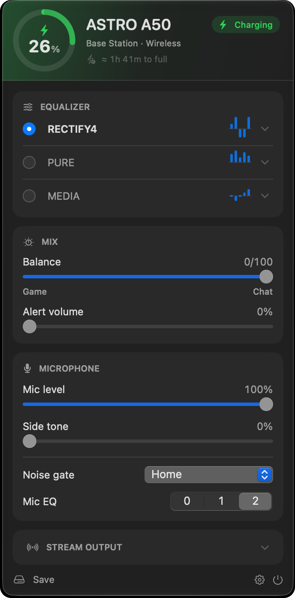
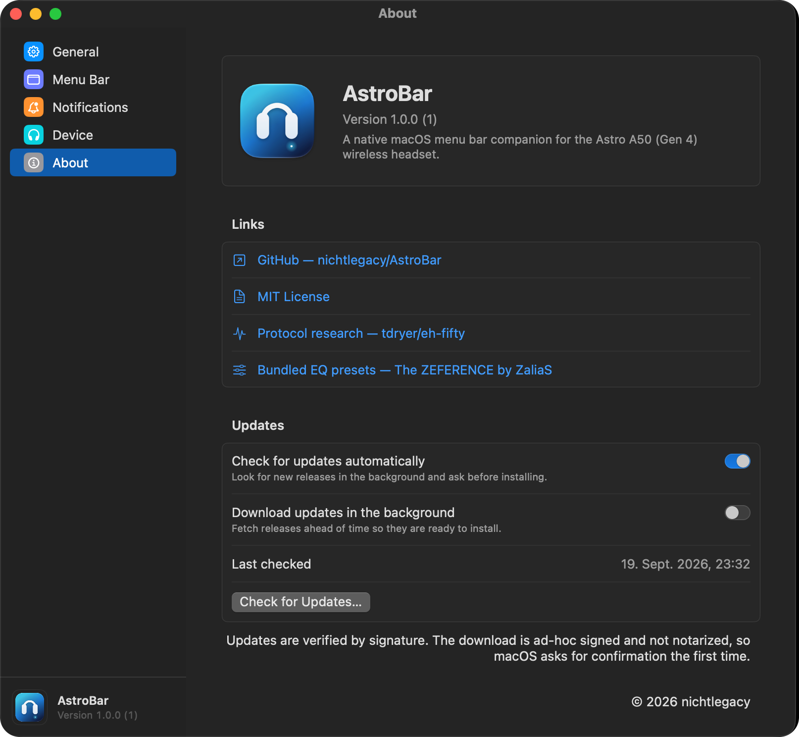
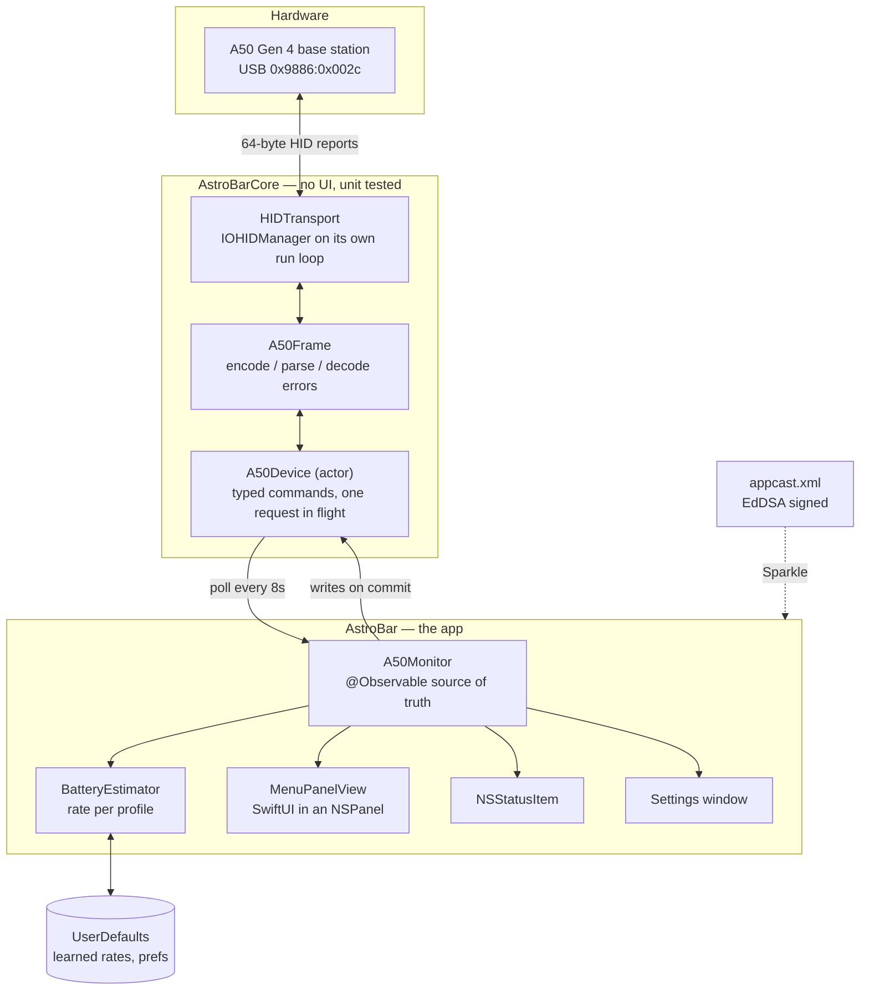

<div align="center">

# AstroBar

**A native macOS menu bar companion for the ASTRO A50 (Gen 4) wireless headset.**
<br>
Battery, equalizer, mix and microphone — read *and* written straight over USB HID.
No Logitech G HUB, no Astro Command Center, no background service.

[](https://www.apple.com/macos/)
[](https://swift.org)
[](#architecture)
[](#updates)
[](#development)
[](LICENSE)

[Website](https://astrobar.nichtlegacy.com) • [Overview](#overview) • [Install](#install) • [The panel](#the-panel) • [Equalizer presets](#equalizer-presets) • [Settings](#settings) • [Architecture](#architecture) • [Development](#development) • [Releasing](#releasing)



</div>

## Overview

The A50 Gen 4 base station exposes everything over a vendor-defined USB HID
interface — charge level, dock state, the full parametric equalizer, the mix
sliders, the microphone. Astro Command Center could reach all of it, but it was
discontinued and never ran on Apple silicon. G HUB does not cover the Gen 4.

AstroBar is that control panel, rebuilt as a Mac menu bar app. It talks to the
base station directly through `IOHIDManager` — no root, no kext, no driver, no
helper process.

The project stays deliberately:

- **menu-bar-first** — no main window, no Dock icon, no launch screen.
- **local-first** — nothing leaves the machine, no account, no telemetry.
- **near dependency-free** — [Sparkle](https://sparkle-project.org) for in-app
  updates is the only external Swift package.
- **honest about what it knows** — an estimate is withheld until it has been
  measured, and a reading the base station only remembers is labelled as such.

> Unofficial hobby project. Not affiliated with, endorsed by, or sponsored by
> Logitech or ASTRO Gaming — see [Disclaimer](#disclaimer).

## Highlights

- **Battery and power** — ring gauge, optional percentage in the menu bar, and a
  low-battery notification with a configurable threshold.
- **Estimated time** — how long the charge will last, or how long it still needs
  to fill up. Learned from the observed rate, kept separately for discharging,
  charging on the base and charging in use, and remembered across restarts.
- **Resolved power state** — the hardware reports dock, radio link and charging
  as three separate bits; the panel shows one answer: *In use*, *Charging*,
  *Charged*, *Off*.
- **Full parametric equalizer** — three slots, each with per-band gain (±7 dB),
  centre frequency (80–15 000 Hz) and bandwidth. Rename slots inline.
- **15 loadable presets** — the five originals from Astro Command Center plus ten
  from The ZEFERENCE, with JSON import. See [Equalizer presets](#equalizer-presets).
- **Mix** — game/chat balance and alert volume.
- **Microphone** — level, side tone, noise gate (Streaming / Night / Home /
  Tournament) and mic EQ.
- **Stream output** — the levels going to the base station's stream port, which
  is what an audience hears: Mic, Chat, Game, Aux.
- **Automatic updates** — signature-verified, through Sparkle.
- **Diagnostic CLI** — `astrobar-cli` speaks the same protocol from a terminal.

## Requirements

- macOS 14 (Sonoma) or later
- An ASTRO A50 **Gen 4** with its base station, connected by USB
- To build: Xcode 26 or a current Apple Swift 6.2 toolchain

> **Not supported:** the A50 X / Gen 5 (2024+) speaks a completely different
> protocol from the Logitech G HUB family. Plugging a Gen 4 headset in by USB
> *cable* enumerates as a plain audio device (`0x9886:0x002b`) that charges but
> exposes no control interface at all.

## Install

Prebuilt disk images live under
[Releases](https://github.com/nichtlegacy/AstroBar/releases).

1. Download `AstroBar-<version>.dmg` and open it.
2. Drag `AstroBar.app` into `Applications`.
3. Clear the quarantine flag — see below.
4. Launch it. The icon appears in the menu bar; no window opens.

### Gatekeeper on first launch

This project has no Apple Developer account, so the app is **ad-hoc signed and
not notarized**. macOS blocks it the first time and claims it is damaged or from
an unverified developer. That is expected and does not mean the download is
broken.

```sh
xattr -dr com.apple.quarantine /Applications/AstroBar.app
```

Or open it once via **System Settings → Privacy & Security → Open Anyway**.

Locally built copies carry no quarantine flag and open normally.

### From source

```sh
git clone https://github.com/nichtlegacy/AstroBar.git
cd AstroBar
make install        # builds, installs to /Applications and launches
```

## The panel

Click the menu bar icon to open it, click again to close it — like any system
menu. Escape closes it too, and expanded sections collapse again when it closes.

Everything except **Save** applies live. **Save** writes the current values into
the headset so they survive a power cycle; the button turns green on success and
red on failure, then goes back.

| Section | What it does |
|---|---|
| **Header** | Charge ring, model, where the headset is, what it is doing, and the estimated time to empty or full |
| **Equalizer** | Pick the active slot, expand one to edit its five bands, rename it, or replace it from the preset library |
| **Mix** | Game/chat balance and alert volume |
| **Microphone** | Mic level, side tone, noise gate, mic EQ |
| **Stream output** | Collapsed by default — the levels your audience hears |

## Equalizer presets

The A50 has three writable EQ slots. AstroBar ships 15 tunings you can load into
any of them from the menu next to the preset's name field. Loading one overwrites
that slot's name, gains and all five bands — but only becomes permanent once you
press **Save**, so you can audition freely and power-cycle the headset to get
your originals back.

### Astro Command Center

The five presets the discontinued Command Center shipped, recovered from a USB
capture of it writing each preset to a slot.

| Preset | Good for | What it does |
|---|---|---|
| **ASTRO** | Games, trailers | The house sound — a pronounced V: bass and treble up, mids scooped |
| **PRO** | Bass-heavy games | Bass lift plus a strong presence peak, mids pulled back |
| **STUDIO** | Critical listening | Flat through the low end, brightened on top |
| **MEDIA** | Music, video, voice chat | The gentlest of the five: a small dip where boominess lives, a modest lift for dialogue |
| **A50 MOD KIT** | Mod Kit cushions only | On stock cushions it corrects something that isn't there |

### The ZEFERENCE by ZaliaS

Ten presets from [The ZEFERENCE](https://github.com/XxUnkn0wnxX/TheZEFERENCE),
distributed as `.astroeq` files — the same format Command Center reads. All
tuning work is ZaliaS's; AstroBar only converts the published values into the
form the device expects.

| Preset | Good for | What it does |
|---|---|---|
| **RECTIFY4** | A neutral baseline | The only preset written for this exact headset: flattens the A50 Gen 4's own colouration towards a studio reference |
| **PURE** | Music, film, games | Broad all-rounder, generous in the bass |
| **DYSTRILATION** | Instrumental music | Crisp mids and treble, detail first |
| **INCENDIARY** | Film, Plex, YouTube | Theatrical weight in the low and mid range |
| **KRYOGEN** | Mixed listening | The reverse of Incendiary — lows and treble, mids left neutral |
| **ARCTURUS** | Any game | Broad, weighty tuning meant to suit everything |
| **OMNIVOX** | Shooters, generally | Low/mid focus for audible footstep direction |
| **TOURNAMENT I / II / III** | Competitive FPS | Three takes on positional clarity — the author's advice is to try all three and keep whichever suits your game |

Only presets that apply to an A50 Gen 4 are bundled. The collection's A40 and
Gen 3 tunings target different hardware, and its per-game presets are too narrow
for a menu bar app — get those from the source repository.

> Which preset sounds best is a matter of taste and of your ears. These
> descriptions come from the authors and from the filter curves, not from
> measurements taken on your unit.

### Import

**Import from File…** in the same menu reads a JSON preset file:

```json
{
  "version": 1,
  "presets": [
    {
      "name": "MY PRESET",
      "gain": [0, -3, 0, 2, 4],
      "bands": [
        { "centerFreq": 95,   "bandwidth": 0 },
        { "centerFreq": 406,  "bandwidth": 8192 },
        { "centerFreq": 783,  "bandwidth": 8192 },
        { "centerFreq": 3901, "bandwidth": 6963 },
        { "centerFreq": 6339, "bandwidth": 0 }
      ]
    }
  ]
}
```

`bandwidth` is the figure Command Center shows (0.1–3.0) multiplied by 4096. The
outer two bands are shelves and carry no width. Presets without exactly five
bands are skipped, and a file with none left is rejected rather than partially
written to the hardware.

## Settings

Open Settings from the gear in the panel footer, the status item's right-click
menu, or <kbd>⌘</kbd><kbd>,</kbd>. It always opens on **General**.

<div align="center">

</div>

| Pane | What you can do |
|---|---|
| **General** | Launch AstroBar at login |
| **Menu Bar** | Show the battery percentage next to the icon, and choose between a headphone or a battery-level icon |
| **Notifications** | Turn the low-battery alert on and pick its threshold (5–50 %) |
| **Device** | Connection state, USB id, base and headset firmware versions, auto-shutoff timer |
| **About** | Version, links, and the update controls below |

### Updates

Installed copies keep themselves current through
[Sparkle](https://sparkle-project.org). AstroBar checks the appcast in this
repository, and every download is verified against an **EdDSA signature** before
it is installed. That check does not involve Apple, so it still means something
even though the build is not notarized: an update can only come from whoever
holds the private key.

In **Settings → About → Updates**:

- **Check for updates automatically** — look for new releases in the background
  and ask before installing anything. Nothing is ever installed silently.
- **Download updates in the background** — fetch releases ahead of time so
  they're ready to install. Only available while automatic checks are on.
- **Last checked** — when the feed was last read.
- **Check for Updates…** — a manual check that shows Sparkle's window even when
  you are already up to date.

The same manual check sits in the status item's right-click menu and in the app
menu. Updates stay idle in debug builds and whenever the bundle carries no feed
URL, which is the case under `swift run`.

## Architecture



### The wire protocol

The control interface is a vendor-defined HID endpoint (usage page `0xFF32`)
carrying fixed 64-byte reports. It was reverse-engineered by
[tdryer/eh-fifty](https://github.com/tdryer/eh-fifty):

- Request: `[0x02, command, (length, …payload)]`
- Response: `[0x02, status, length, …data]` — `0x02` is OK, `0x01` is an error

Error replies carry a little-endian code and a NUL-terminated ASCII name four
bytes into the payload, which AstroBar surfaces verbatim:

```
02 01 24 0d 00 00 00 48 49 44 5f ...
..$....HID_ERROR_NO_EQ_WITH_THAT_VALUE
```

Three firmware behaviours the code works around, all confirmed against hardware:

- The declared reply length is unreliable **in both directions** — the firmware
  pads and under-reports — so callers state how many bytes they need.
- Applying an EQ preset is asynchronous: the write is acknowledged before it
  takes effect, so the setter polls the read-back.
- Bit 1 of `0x54` is the **radio link**, not simply "powered on". The base keeps
  answering with the last known battery level after the link drops, so those
  readings are marked stale and kept out of the estimator and the alert.

### Packages

| Package | Kind | Purpose |
|---|---|---|
| `AstroBarCore` | library | HID transport, wire protocol, models, request codec. No UI. |
| `AstroBar` | app | SwiftUI content inside an AppKit menu bar shell. |
| `astrobar-cli` | executable | Diagnostic dump of every value the device exposes. |

## Diagnostics

`astrobar-cli` speaks the same protocol from a terminal — useful for bug reports:

```sh
swift run astrobar-cli dump             # read-only dump of every value
swift run astrobar-cli get-eq           # print the active EQ preset
swift run astrobar-cli set-eq 2         # set the active EQ preset (writes!)
swift run astrobar-cli selftest-write   # toggle EQ preset and restore it (writes!)
swift run astrobar-cli probe-error      # hex-dump the device's error frames
```

## Development

```sh
swift build && swift test          # no hardware required
./scripts/package_app.sh release   # assemble AstroBar.app
make dmg                           # distributable disk image
make icon                          # regenerate the app icon
```

Unit and render tests run without a device; only live reads and writes need
hardware. See [CONTRIBUTING.md](CONTRIBUTING.md) for code style and PR guidelines.

## Releasing

Releases are cut locally, not from CI: signing the appcast needs the private
EdDSA key, which lives in the login keychain and never leaves the machine.

```sh
scripts/release.sh --version 1.0.0 --dry-run   # rehearse, publishes nothing
scripts/release.sh --version 1.0.0             # build, tag, publish, update appcast
```

The script refuses to run on a dirty worktree or off `main`, verifies the key is
reachable before it tags anything, and asks for confirmation before publishing.
Release notes come from `.github/release-notes/<version>.md` when present,
otherwise from the commit log.

> **Back up the signing key.** Without an Apple Developer account this key is the
> only thing proving an update came from you. Lose it and every installed copy
> stops accepting updates; leak it and anyone can ship an update to every
> installed copy.
>
> ```sh
> scripts/backup_sparkle_key.sh ~/somewhere-encrypted/astrobar-sparkle-key.txt
> ```

## Acknowledgments

AstroBar stands on work other people did first.

- **[tdryer/eh-fifty](https://github.com/tdryer/eh-fifty)** — the original reverse
  engineering of the Gen 4 HID protocol. Every command byte this app sends was
  documented there first.
- **[ZaliaS — The ZEFERENCE](https://github.com/XxUnkn0wnxX/TheZEFERENCE)** — the
  ten bundled community EQ presets (RECTIFY4, PURE, DYSTRILATION, INCENDIARY,
  KRYOGEN, ARCTURUS, OMNIVOX and the Tournament series). All tuning work is
  theirs. The full collection, including A40, Gen 3 and per-game presets, lives
  in the source repository.
- **[manuacl/astro-a50-gui](https://github.com/manuacl/astro-a50-gui)** — recovered
  the five original Astro Command Center presets from a USB capture.
- **[Sapd/HeadsetControl](https://github.com/Sapd/HeadsetControl)** — protocol
  notes that corrected real bugs here, in particular that the base station keeps
  serving the last known battery level after the headset drops off the radio link.
- **[Sparkle](https://sparkle-project.org)** — in-app updates.
- App architecture inspired by
  [steipete/CodexBar](https://github.com/steipete/CodexBar).

## License

[MIT](LICENSE). Do what you like with it.

## Disclaimer

**AstroBar is an unofficial, independent hobby project.** It is not affiliated
with, endorsed by, sponsored by, or connected to Logitech or ASTRO Gaming in any
way.

I have simply been a big fan of the A50 for years and use it every day. When
Astro Command Center was discontinued and never made it to Apple silicon, the
headset kept working but lost its control panel on the Mac. This app exists to
give it one back.

"ASTRO", "A50" and related marks are trademarks of their respective owners and
are used here only to describe which hardware this app talks to.
